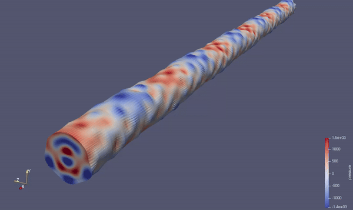

# pyWFE

#### Python implementation of the Wave Finite Element (WFE) method.

---

The WFE method predicts wave propagation in waveguides of any length by meshing a small segment of the waveguide in conventional FE and applying periodic boundary conditions. 

This Python package applies the WFE method to given mesh data and uses a single class which provides the functionality to:

- Sort system matrices and condense internal degrees of freedom.

- solve the WFE eigenproblem (mode shapes, propagation constants) and sort the solutions

- Apply harmonic forcing to the system

- Solve response any axial distance

And other helpful features. 

The package was developed to study mechanical waves in fluid-filled pipes. 

---

[Find the documentation HERE](https://pywfe.readthedocs.io/en/latest/)

---

**

*forced response of water pipe calculated and exported into `.vtu` format with `pywfe` package*  

---
