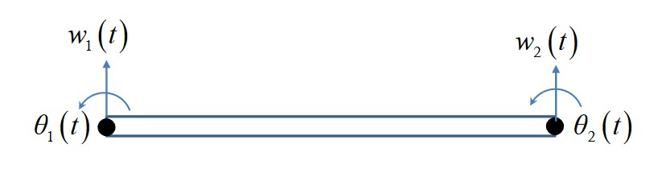
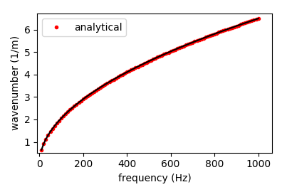
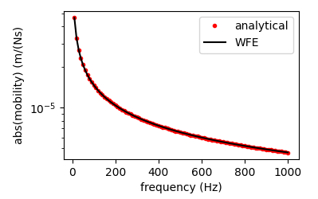

Analytical Beam Example
=======================

In this example, we'll go through the process of setting up a model of an `Euler-Bernoulli <https://en.wikipedia.org/wiki/Euler%E2%80%93Bernoulli_beam_theory>`_ beam using the ``pywfe`` package.

Introduction
------------

An Euler-Bernoulli beam can be described with a finite element approximation giving the mass and stiffness matrices:

.. math::

    \mathbf{M}=\frac{\rho A l}{420}\left[\begin{array}{cccc}
    156 & 22 l & 54 & -13 l \\
    22 l & 4 l^2 & 13 l & -3 l^2 \\
    54 & 13 l & 156 & -22 l \\
    -13 l & -3 l^2 & -22 l & 4 l^2
    \end{array}\right] \quad\mathbf{K}=\frac{E I}{l^3}\left[\begin{array}{cccc}
    12 & 6 l & -12 & 6 l \\
    6 l & 4 l^2 & -6 l & 2 l^2 \\
    -12 & -6 l & 12 & -6 l \\
    6 l & 2 l^2 & -6 l & 4 l^2
    \end{array}\right]

For a beam segment of length :math:`l`, cross-sectional area :math:`A` made from a material with Young's modulus and density :math:`E, \rho`, and second moment of area :math:`I`.
These matrices relate the displacement/rotation vector :math:`[w_1, \theta_1, w_2, \theta_2]^T` with the force/moment vector :math:`[F_1, M_1, f_2, F_2]^T` by

.. math::

    \begin{bmatrix}
    w_1\\
    \theta_1\\
    w_2\\
    \theta_2
    \end{bmatrix} \left(\mathbf{K} - \omega^2 \mathbf{M} \right) = \begin{bmatrix} F_1\\
    M_1\\
    F_2\\
    M_2
    \end{bmatrix}

The FE model only has two nodes with two degrees of freedom each. The analytical formulation of an infinite beam has well known solutions. 
The dispersion relation for transverse waves is

.. math::

    k = \sqrt{ \frac{\omega}{a} }
    

The transfer mobility is subject to a transverse point force at :math:`x=0` is

.. math::

    v(x, \omega)=-\frac{\omega}{4 E I k^3}\left(i e^{-k x}-e^{-i k x}\right)

Creating pywfe Model of Beam
----------------------------

To begin with we define the system parameters

.. code-block:: python

    import numpy as np
    import pywfe
    import matplotlib.pyplot as plt

    E = 2.1e11  # young mod
    rho = 7850  # density
    h = 0.1  # bean cross section side length length
    A = h**2  # beam cross sectional area
    I = h**4 / 12  # second moment of area

    a = np.sqrt(E*I/(rho*A))  # factor in dispersion relation

and define the known solutions for the analytical dispersion relation and transfer mobility

.. code-block:: python

    def euler_wavenumber(f):
        # wavenumber of euler bernoulli beam
        return np.sqrt(2*np.pi*f/a)

    def transfer_velocity(f, x):
        # transfer velocity for beam x > 0
        k = euler_wavenumber(f)
        omega = 2*np.pi*f

        return -omega/(4*E*I*k**3) * (1j*np.exp(-k*x) - np.exp(-1j*k*x))

For the FE discretisation, the beam length must be significantly shorter than the minimum wavelength. We define maximum frequency and find the maximum wavenumber analytically to set the beam length for WFE modelling.

.. code-block:: python

    f_max = 1e3  # maximum frequency
    lambda_min = 2*np.pi/euler_wavenumber(f_max)  # mimimum wavelength
    l_max = lambda_min / 10  # unit cell length max - 10 unit cells per wavelength

    l = np.round(l_max, decimals=1)  # rounded unit cell length chosen

Now the mass and stiffness matrices can be defined

.. code-block:: python

    # stiffness matrix
    K = E*I/(l**3) * np.array([

        [12,    6*l,    -12,   6*l],
        [6*l, 4*l**2, -6*l, 2*l**2],
        [-12,   -6*l,    12,  -6*l],
        [6*l, 2*l**2, -6*l, 4*l**2]

    ])

    # mass matrix
    M = rho*A*l/420 * np.array([

        [156,   22*l,      54,    -13*l],
        [22*l,  4*l**2,  13*l,  -3*l**2],
        [54,    13*l,     156,    -22*l],
        [-13*l, -3*l**2,  -22*l, 4*l**2]

    ])

These, along with the 'mesh' information are all that are needed to create the `pywfe.Model` object. The mesh information is given with a dictionary with three keys `node`, `fieldvar` and `coord`.
These specify the node number, field variable, and coordinates in 1-3D of each degree of freedom in the model. The beam has 4 degrees of freedom, ordered as in the displacement vectors. Thus we define the `dof` dictionary

.. code-block:: python

    dof = {'node': [0, 0, 1, 1],
        'fieldvar': ['w', 'phi']*2,
        'coord': [
                    [0, 0, l, l],
                    [0, 0, 0, 0]
    ]
    }

which describes the two nodes, the field quantities `w`, `phi` (repeated on each node), and the coordinates of each degree of freedom.
The coordinates are given in `x` and `y` with two lists for demonstrative purposes. Only the first is required for this 1D model. 

NOTE: It is important that the waveguide axis is correctly chosen. By default the first axis in the coordinate set is used as the waveguide axis. 
If your mesh information contains coordinates `[x_arr, y_arr, z_arr]` for example, and `z_arr` is the waveguide axis, then set `axis = 2` or `axis = -1` when initialising the model. 
See 'Initialisation' in :class:`pywfe.model.Model`. 

The pywfe.Model object can now be created

.. code-block:: python

    beam_model = pywfe.Model(K, M, dof)

At this point, you might want to check the model with :func:`pywfe.Model.see`, which creates an interactive matplotlib view of the nodes in the mesh. 
In this case however there is only one node to look at. The model can now be saved with :func:`pywfe.save`.

Usage
-----

Free Waves
++++++++++

Firstly let's check the dispersion relation with the analytical solution 

.. code-block:: python

    #create frequency array
    f_arr = np.linspace(10, f_max, 100)

    # calculate the wfe wavenumbers
    k_wfe = beam_model.dispersion_relation(f_arr)

    plt.plot(f_arr, euler_wavenumber(f_arr), '.', color='red', label='analytical')
    plt.plot(f_arr, k_wfe, color='black')

    plt.legend(loc='best')
    plt.xlabel("frequency (Hz)")
    plt.ylabel("wavenumber (1/m)")

Forcing
+++++++

Forces can be added to degrees of freedom by changing elements of the `Model.force` array. We compare the mobility in the WFE model with the known solution

.. code-block:: python

    beam_model.force[0] = 1

    x_r = 0

    w = beam_model.transfer_function(f_arr, x_r=x_r, dofs=[0], derivative=1)

    plt.semilogy(f_arr, abs(transfer_velocity(f_arr, x_r)), '.', color='red', label='analytical')
    plt.semilogy(f_arr, abs(w), color='black', label='WFE')

    plt.legend(loc='best')
    plt.xlabel("frequency (Hz)")
    plt.ylabel("abs(mobility) (m/(Ns)")

The `transfer_function` method calculates the response over all frequencies at the response distance `x_r`. The response distance can also be a list or array, in which case a higher dimensional array will be returned. 
The `dofs` keyword argument specifies for which degrees of freedom the output should be returned. In this case we want the same dof as the one we're forcing. The `derivative` keyword argument applies n derivatives in the 
frequency domain, i.e a multiplication of the displacement by :math:`i \omega`. So the output of the method call is the transverse velocity at x=0 for a transverse unit point force. This is the mobility of the beam and is compared 
with the analytical solution. 

See :func:`pywfe.Model.transfer_function` for more information

To save the model for later, use :func:`pywfe.utils.io_utils.save`, where it may be saved in either in the current working directory or the database folder which is located in the user folder by default.
Before saving you can add a description to the model for easier identification with `beam_model.description = '[description string]'`

More Functionality
++++++++++++++++++

For more functionality see :class:`pywfe.Model`