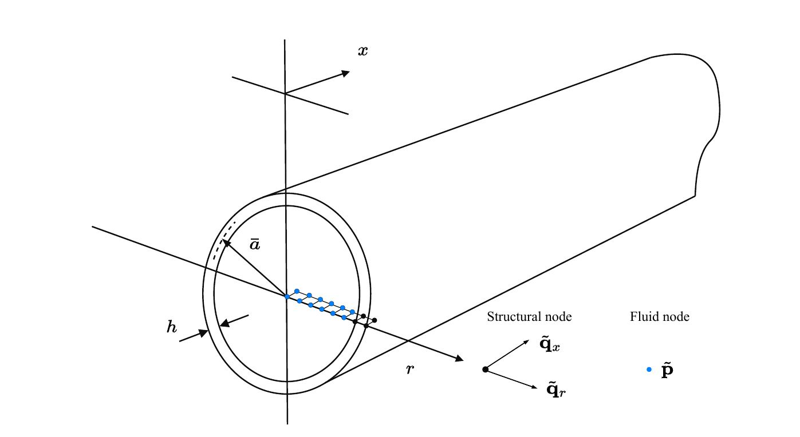

Axisymmetric Fluid Filled Pipe
==============================

This example details a more complex application of the ``pywfe`` package to an axisymmetric fluid filled pipe.

The mesh information was initially generated using COMSOL Multiphysics with cyclic symmetry. As such, the system descibes axisymmetric (otherwise known as :math:`n=0`) motion. 
The pipe structure modelled as steel with a hysteretic loss factor of 0.1%, the inner radius is 0.2m and the outer radius is 0.21

Loading and Inspecting the Model
--------------------------------

The pipe model in this example has been saved into the package database, and can be loaded with 

.. code-block:: python

    import numpy as np
    import pywfe
    import matplotlib.pyplot as plt

    model = pywfe.load("AXISYM_thick_0pt1pc_damping", source='database')

The model description, which is optionally added before saving returns:

.. code-block:: python

    print(model.description)

    >>> WFE Segment of water filled pipe
    >>>
    >>> Inner radius: 20cm, Outer radius: 21cm
    >>> Steel Youngs mod: 19.2e10*(1 + eta_s*i), Poissons ratio: 0.3, Steel density: 7850,
    >>> Water bulk mod: 2.1e9*(1 + eta_f*i), Water density: 1000
    >>>
    >>> Steel loss-factor = 0.001
    >>> Water loss-factor = 0
    >>> maximum element size = 1cm

    >>> Outer radial forcing dof index: 45 

With :meth:`pywfe.Model.see()` the model mesh can be visualised, showing the left face of the segment. In this case, since the model is 2D and axisymmetric, the left face is a line of nodes.

The ``dof`` attribute contains more information about the degrees of freedom. For example, ``print(set(model.dof['fieldvar']))`` will show the unique field variables in the model which are ``'u', 'w' 'p'``. 
These are the two structural (radial and longitdunal) degrees of freedom in the pipe wall and the pressure in the pipe fluid respectively. Clicking on the nodes displayed with :meth:`pywfe.Model.see()` using an 
interactive matplotlib backend will print information about that node.

Free Wave Solutions
-------------------

Dispersion Curves
~~~~~~~~~~~~~~~~~

As with the (:doc:`analytical_beam`), the dispersion curves of the system can be calculated:

.. code-block:: python

    f_arr = np.linspace(10, 10e3, 300)

    k = model.dispersion_relation(f_arr)

    plt.subplot(2, 1, 1)
    plt.plot(f_arr, k.real, '.')
    plt.ylabel('Re(k)')
    plt.ylim(0, 50)

    plt.subplot(2, 1, 2)
    plt.plot(f_arr, k.imag, '.')
    plt.ylabel('Im(k)')
    plt.ylim(0, -50)

    plt.xlabel('Frequency (Hz)')

The solutions wavenumber solutions are not sorted, and so are plotted as a scatter plot. The phase velocity curves can also be computed with :meth:`pywfe.Model.phase_velocity`.
In this case, the wavenumbers are already computed, and the phase velocity can be calculated via its definition. Only strongly propagating modes are plotted:

.. code-block:: python
    
    k_prop = np.copy(k)
    k_prop[abs(k.imag) > 0.5] = np.nan

    c_p = 2*np.pi*f_arr[:, None]/k_prop

    plt.plot(f_arr, c_p, '.')
    plt.ylim(0, 8e3)

    plt.xlabel('Frequency (Hz)')

Mode Shapes
~~~~~~~~~~~

Also of interest for the free-wave solutions are the mode shapes. These could be calculated for each frequency with :meth:`pywfe.Model.generate_eigensolution`, which gives the raw eigensolution. 
Instead, it is convenient to use the :meth:`pywfe.Model.frequency_sweep` method, which allows many different frequency dependent quantities to be solved together with each frequency step. 
The positive-going wavenumbers and mode shapes are requested for the frequency sweep, and are stored in a dictionary. 

.. code-block:: python

    sweep_result = model.frequency_sweep(
    f_arr, quantities=['wavenumbers', 'phi_plus'])

**NOTE**: The :meth:`pywfe.Model.frequency_sweep` method allows the `modal assurance criterion` to be used to track each mode across sufficiently fine frequency steps. 

.. code-block:: python
    
    sweep_result = model.frequency_sweep(
    f_arr, quantities=['wavenumbers', 'phi_plus'], mac = True)

Now the dispersion relation can be plotted with continuous curves in the wavenumber domain:

.. code-block:: python

    plt.subplot(2, 1, 1)
    plt.plot(f_arr, sweep_result['wavenumbers'].real)
    plt.ylabel('Re(k)')
    plt.ylim(0, 50)
    plt.subplot(2, 1, 2)
    plt.plot(f_arr, sweep_result['wavenumbers'].imag)
    plt.ylabel('Im(k)')

    plt.xlabel('Frequency (Hz)')
    plt.ylim(0, -50)

The mode shapes from the frequency sweep have the shape ``(n. frequencies, n. dofs, n.modes)``. 

.. code-block:: python

    phi = np.copy(sweep_result['phi_plus'])

    print(phi.shape)
    >>> (300, 94, 47)

The first half of the dof axis represents the free-wave modal displacements, and the second half the forces. We select just the displacement part of the mode shapes with

.. code-block:: python

    # get just the displacement component of the mode shapes by slicing down the second axis
    phi_q = phi[:, :model.N//2, :]

Selecting Degrees of Freedom
++++++++++++++++++++++++++++

The displacement mode shapes contain both the structural displacements and pressures. To separate these out, the method :meth:`pywfe.Model.select_dofs` is provided. 
The dofs are selected by their field variable with:

.. code-block:: python
    
    struc_dof = model.select_dofs(fieldvar=['u', 'w'])
    fluid_dof = model.select_dofs(fieldvar='p')

which returns a reduced dof dictionary for each selection. To select the part the corresponding part of the mode shape array, :meth:`pywfe.Model.dof_to_indices` is used:

.. code-block:: python

    fluid_dof_indices = model.dof_to_indices(fluid_dof)
    phi_p = phi_q[fluid_dof_indices]

``phi_p`` now represents the *pressure* mode shapes.

Mode Sorting
""""""""""""

Before plotting the mode shapes, There is one more useful function for sorting the free-wave solutions. 
The function :func:`pywfe.sort_wavenumbers` can be used on a wavenumber solution to produce sorted indices for modes according to their order of cut-on. 

The free-wave solutions can now be sorted along the modal axis with

.. code-block:: python

    sorted_mode_indices = pywfe.sort_wavenumbers(sweep_result['wavenumbers'])

    k_sorted = np.copy(sweep_result['wavenumbers'])[..., sorted_mode_indices]
    phi_p_sorted = np.copy(phi_p)[..., sorted_mode_indices]

``np.copy`` is used to keep the sorted and unsorted solutions separate to avoid confusion. The pressure mode shapes for the first two propagating modes are now plotted at a low frequency:

.. code-block:: python

    radial_coord = fluid_dof['coord'][1]
    frequency_index = 10

    for mode_index in [0, 1]:

        plt.subplot(2, 1, 1)

        plt.plot(radial_coord, phi_p_sorted[frequency_index, :, mode_index])
        plt.axhline(y=0)
        plt.xlabel('radial coordinate (m)')
        plt.ylabel('pressure (arb)')

        plt.subplot(2, 1, 2)

        plt.plot(f_arr, 2*np.pi*f_arr /
                k_sorted[..., mode_index], label=f'mode {mode_index}')
        plt.axvline(x=f_arr[frequency_index], color='black')
        plt.xlabel('frequency (Hz)')
        plt.ylabel('Phase velocity (m/s)')

    plt.legend(loc='best')
    plt.suptitle(f'Frequency: {f_arr[frequency_index]:.0f} Hz')
    plt.tight_layout()
    plt.title()

Now all 5 propagating pressure modes at the maximum frequency of interest are plotted:

.. code-block:: python

    frequency_index = -1

    # plot only the propagating wavenumbers
    k_sorted_propagating = np.copy(k_sorted)
    k_sorted_propagating[abs(k_sorted.imag) > 0.5] = np.nan

    for mode_index in [0, 1, 2, 3, 4]:

        plt.subplot(2, 1, 1)

        plt.plot(radial_coord, phi_p_sorted[frequency_index, :, mode_index])
        plt.axhline(y=0, color='black', linestyle=':')
        plt.xlabel('radial coordinate (m)')
        plt.ylabel('pressure (arb)')

        plt.subplot(2, 1, 2)

        plt.plot(f_arr, 2*np.pi*f_arr /
                k_sorted_propagating[..., mode_index], label=f'{mode_index + 1}')

        plt.axvline(x=f_arr[frequency_index], color='black')
        plt.xlabel('frequency (Hz)')
        plt.ylabel('Phase velocity (m/s)')

    plt.subplot(2, 1, 2)
    plt.ylim(0, 10e3)
    plt.legend(loc='best', ncols=5)

Model Forcing
-------------

We now add a radial force to the outer pipe wall with the appropriate degree of freedom. 

.. code-block:: python

    # add a 1 newton radial force to the outer pipe wall
    model.force[45] = 1 

With this loading added the forced response can be calculated with a number of methods. For example, to calculate the pressure field at ``x=0``:

.. code-block:: python

    # plot the pressure across the the radial coordinate at x=0
    excitation_frequency = 15e3

    p0 = model.displacements(f=excitation_frequency, x_r=0, dofs=fluid_dof)

    plt.plot(radial_coord, p0)
    plt.xlabel('radial coordinate (m)')
    plt.ylabel('pressure (Pa)')
    plt.title(f'frequency: {excitation_frequency} Hz')

Or to calculate the radial displacement at the outer wall (the same dof at which the forcing was applied):

.. code-block:: python

    excitation_frequency = 1000

    x_arr = np.linspace(0, 100, 1000)

    u_x = model.displacements(f=excitation_frequency, x_r=x_arr, dofs=[45])

    plt.plot(x_arr, u_x)
    plt.xlabel('axial coordinate (m)')
    plt.ylabel('displacement (m)')
    plt.title(f'frequency: {excitation_frequency} Hz')

To calculate the input mobility, we use :meth:`pywfe.Model.tranfer_function` at ``x=0`` over a given frequency range with ``derivative=1`` to return the structural velocity (the input force is 1N)

.. code-block:: python

    input_mobility = model.transfer_function(f_arr, x_r=0, dofs=[45], derivative=1)

    plt.semilogy(f_arr, abs(input_mobility))
    plt.xlabel('Frequency (Hz)')
    plt.ylabel('input mobility (m/Ns)')

.. image:: axisym_pipe_imgs/input_mobility.JPG
   :align: center

Finally, to allow easier visualisation of results without wrestling with matplotlib, a displacement/pressure field can be saved into the `.vtu` format for loading into ParaView. See :func:`pwfe.save_as_vtk`.
Here we save the pressure field from 0-2m at an excitation frequency of 4kHz

.. code-block::python

    excitation_frequency = 4e3
    x_arr = np.linspace(0, 2, 400)

    p_x = model.displacements(f=excitation_frequency, x_r=x_arr, dofs=fluid_dof)

    pywfe.save_as_vtk('pressure field', p_x, x_arr, fluid_dof)

